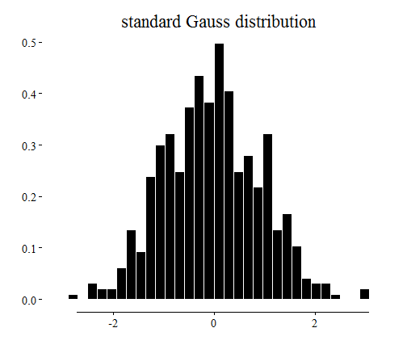
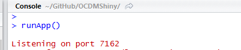
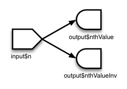

## Introduction: About

<br>
**Me**
- Diplom Mathematician (2007)
- PhD in Stochastics (2011)
<br>
<br>

**Professional**
- 2012 - 2013 Biostatistician at Dr. Margarete Fischer-Bosch Institute for Clinical Pharmacology
- 2012 - today MUON-STAT - Statistical Services and Consultancy
  - Statistical Consulting 
  - Software & Data Managment
  - Training R, SPSS and Statistics


--- &twocolcustomwidth 

## Introduction: What is Shiny ? 

<br>
Shiny is a R-package from [RStudio Inc.](http://www.rstudio.com/) 

*** =left width:75%
- Originally developed my Joe Cheng
- Write interactive Web Applications Using (only) R
- no Need for HTML or Javascript for basic applications 
- **Open-Source** and **Enterprise** Version
- Many extensions from the R-Community (rCharts, a workaround for multiple pages, ...)
- Great for communication and vizualiation 
  - teaching
  - interactive data analysis
  - custom analytic tools to explore data
  - interactive presentation of your statistical analysis

*** =right width:25%
<div align='center' style='width:100%;margin-left:auto;margin-right:auto;padding-bottom:5px; float:right;'>
  
</div>


--- 
## Introduction: Resources

<br>
- **Showcases**
  - [http://www.rstudio.com/shiny/showcase/](http://www.rstudio.com/shiny/showcase/)<br>
- **Tutorial from RStudio**
  - [http://rstudio.github.io/shiny/tutorial/](http://rstudio.github.io/shiny/tutorial/)
- **Getting Help: Community**
  - [Google Shiny Group](https://groups.google.com/forum/#!forum/shiny-discuss)
  - [Stackoverflow](http://stackoverflow.com/)
- **Book**
    - *Web Application Development Using R With Shiny by Chris Beeley*


---
## Showcase: Simple Example

<div class="row-fluid">
  <div class="span4">
    <form class="well">
      <div>
        <label class="control-label" for="obs">Number of observations:</label>
        <input id="obs" type="slider" name="obs" value="500" class="jslider" data-from="1" data-to="1000" data-step="1" data-skin="plastic" data-round="false" data-locale="us" data-format="#,##0.#####" data-smooth="false"/>
      </div>
      <label class="checkbox" for="density">
        <input id="density" type="checkbox"/>
        <span>Density</span>
      </label>
      <hr/>
      <label for="Title">Title</label>
      <input id="Title" type="text" value=""/>
    </form>
  </div>
  <div class="span8">
    <div id="distPlot" class="shiny-plot-output" style="width: 100% ; height: 400px"></div>
  </div>
</div>

- Left side (*sidebar panel*) : **inputs** 

- Right side (*main panel*) : **outputs**

- *Engine* : interface is running through two **R** files, namely `ui.R` and `server.R` 


--- &twocolcustomwidth 
## Shiny: Structure

<br>
A shiny app consists of two files:
*** =left width:66%
**ui.R** (client side):
- User Interface
- Translation of the R-Code to a HTML webpage

<br><br>
To run a shiny app:
<pre><code class="r" style="font-size:80%">library(shiny)
shiny::runApp(AppPath)
</code></pre>

`AppPath` is the path that contains `ui.R` and `server.R`

*** =right width:33%
**server.R** (server side):
- data analysis
- computation


--- &twocolcustomwidth 
## Shiny: Structure

*** =left width:33%
**ui.R :**
<pre><code class="r" style="font-size:80%">shinyUI(pageWithSidebar(
  headerPanel("app title"),
  sidebarPanel(   
    ***SET INPUTS*** 
  ),
  mainPanel(    
    ***RENDER OUTPUTS***
  )
  
))
</code></pre>

- Inputs are elements of the `input` list 
- Outputs are elements of the `output` list 

*** =right width:66%
**server.R :**
<pre><code class="r" style="font-size:80%">shinyServer(function(input, output, session) {

  ***GET INPUTS AND MAKE OUTPUTS*** 
  
})
</code></pre>

**ui.R:**
  - <u>*set input*</u>: Inputs are set through the *widgets* in the interface:  
<span style="border-style:solid;border-width:1px;border-color:yellow">`textInput(inputId="title", label="Title")`</span> 
  - <u>*render output*</u>: <span style="border-style:solid;border-width:1px;border-color:yellow">`plotOutput("plot")`

**server.R:**
  - <u>*get input*</u>:  <span style="border-style:solid;border-width:1px;border-color:yellow">`input$title`</span> (or <span style="border-style:solid;border-width:1px;border-color:yellow">`input[["title"]]`</span>)
  - <u>*make output*</u>: <span style="border-style:solid;border-width:1px;border-color:yellow">`output$plot <- renderPlot({ ... })`</span>
  
  

--- 
## Shiny: Build-in Widgets

<div class="row-fluid">
  <div class="span4">
    <form class="well">
      <div>
        <label class="control-label" for="integer">Integer:</label>
        <input id="integer" type="slider" name="integer" value="500" class="jslider" data-from="0" data-to="1000" data-step="1" data-skin="plastic" data-round="false" data-locale="us" data-format="#,##0.#####" data-smooth="false"/>
      </div>
      <div>
        <label class="control-label" for="decimal">Decimal:</label>
        <input id="decimal" type="slider" name="decimal" value="0.5" class="jslider" data-from="0" data-to="1" data-step="0.1" data-skin="plastic" data-round="false" data-locale="us" data-format="#,##0.#####" data-scale="|;|;|;|;|;|;|;|;|;|;|" data-smooth="false"/>
      </div>
      <div>
        <label class="control-label" for="range">Range:</label>
        <input id="range" type="slider" name="range" value="200;500" class="jslider" data-from="1" data-to="1000" data-step="1" data-skin="plastic" data-round="false" data-locale="us" data-format="#,##0.#####" data-smooth="false"/>
      </div>
      <label class="control-label" for="dataset">Choose a dataset:</label>
      <select id="dataset">
        <option value="rock" selected="selected">rock</option>
        <option value="pressure">pressure</option>
        <option value="cars">cars</option>
      </select>
      <label for="obsN">Number of observations to view:</label>
      <input id="obsN" type="number" value="10"/>
      <div id="rb" class="control-group shiny-input-radiogroup">
        <label class="control-label" for="rb">Radio Buttons</label>
        <label class="radio">
          <input type="radio" name="rb" id="rb1" value="a" checked="checked"/>
          <span>a</span>
        </label>
        <label class="radio">
          <input type="radio" name="rb" id="rb2" value="b"/>
          <span>b</span>
        </label>
      </div>
    </form>
  </div>
  <div class="span8">
    <div id="values" class="shiny-html-output"></div>
  </div>
</div>

More widgets: check box, action button, date, date range, grouped check box and file upload.


--- &twocolcustomwidth 
## Shiny: Making an App (1/3)
====================================================
<br>
**Step 1:** Write your regular R-Code: 

*** =left width:50%


```r
distr <- data.frame(distr = rnorm(n = 500))
g <- ggplot(distr, aes(x = distr)) + 
    geom_histogram(aes(y = ..density..), 
        fill = "black", colour = "white", 
        ) + xlab("") + ylab("") + 
    ggtitle("random sample") + geom_rangeframe()
```


*** =right width:50%
 


--- &twocolcustomwidth
## Shiny: Making an App (2/3)
====================================================
<br>
**Step 2:** Embed code into shiny template:


*** =left width:90%

**ui.R :**

```r
  sidebarPanel(
    sliderInput("obs", "Number of observations:", min = 1, max = 1000, value = 500),
    checkboxInput("density", "Density", value=FALSE),
    textInput("Title", label="Title", value="")),
  mainPanel(
    plotOutput("distPlot")
  )
```


*** =right width:9%


--- &twocolcustomwidth
## Shiny: Making an App (2/3)
====================================================
<br>
**Step 2:** Embed code into shiny template:

*** =left width:90%

**server.R :**

```r
dist <- rnorm(input$obs)
dist <- as.data.frame(dist)
g <- ggplot(dist, aes(x = dist)) + geom_histogram(aes(y = ..density..), 
    fill = "black", colour = "white", ) + xlab("") + ylab("") + ggtitle(input$Title) + 
    geom_rangeframe()
if (input$density) {
    g <- g + geom_density(colour = "steelblue", size = 1.25, alpha = 0.5)
}
print(g)
```


*** =right width:9%


--- &twocolcustomwidth
## Shiny: Making an App (3/3)
====================================================
<br>
**Step 3:** Run App:


```r
library(shiny)
setwd(pathToApp)
runApp()
# Alternative: without starting default browser
runApp(launch.browser = FALSE)
```

<br>
The app is now accessible at: <span style="border-style:solid;border-width:1px;border-color:yellow">`http://localhost:xxxx`</span>  where `xxxx` is the port given in the `runApp()` message

<p></p>


--- &twocolcustomwidth
## Shiny: Reactive Programming
====================================================
<br>
What is NOT reactive programming:

```r
a <- 2
b <- 3
c <- a + b
a <- 4  # value of c do not change when value a is changed
```

<br>
reactive programming is:
- if value of `c` changes with `a` 
- shiny is reactive


--- &twocolcustomwidth
## Shiny: Reactive Programming
====================================================
- The output of the output object is *connected* to each input object and is *updated* each time an input object is changed.
- Let us have a look what happens when we *isolate* an input: `isolate(input$Title)`

<div class="row-fluid">
  <div class="span4">
    <form class="well">
      <div>
        <label class="control-label" for="obs1">Number of observations:</label>
        <input id="obs1" type="slider" name="obs1" value="500" class="jslider" data-from="1" data-to="1000" data-step="1" data-skin="plastic" data-round="false" data-locale="us" data-format="#,##0.#####" data-smooth="false"/>
      </div>
      <label class="checkbox" for="density1">
        <input id="density1" type="checkbox"/>
        <span>Density</span>
      </label>
      <hr/>
      <label for="Title1">Title</label>
      <input id="Title1" type="text" value=""/>
    </form>
  </div>
  <div class="span8">
    <div id="distPlot1" class="shiny-plot-output" style="width: 100% ; height: 400px"></div>
  </div>
</div>

- What happens: the output is disconnected from `input$Title` and reads this value only when it reacts


--- &twocolcustomwidth
## Shiny: Reactive Programming

- All input parameters of the plot can be *isolated*, s.t. the user can select the parameters firstly
- The plot is then calculated by pressing a action button;
**ui.R**:

```r
actionButton(inputId = "plotButton", label = "Plot")
```


**Server.R**:

```r
if (input$plotButton == 0) {
    return
} else {
    dist <- rnorm(isolate(input$obsIso))
    
    dist <- as.data.frame(dist)
    g <- ggplot(dist, aes(x = dist)) + geom_histogram(aes(y = ..density..), 
        fill = "black", colour = "white", ) + xlab("") + ylab("") + ggtitle(isolate(input$TitleIso)) + 
        geom_rangeframe()
    if (isolate(input$densityIso)) {
        g <- g + geom_density(colour = "steelblue", size = 1.25, alpha = 0.5)
    }
    print(g)
}
```


--- &twocolcustomwidth
## Shiny: Reactive Programming
<div class="row-fluid">
  <div class="span4">
    <form class="well">
      <div>
        <label class="control-label" for="obsIso">Number of observations:</label>
        <input id="obsIso" type="slider" name="obsIso" value="500" class="jslider" data-from="1" data-to="1000" data-step="1" data-skin="plastic" data-round="false" data-locale="us" data-format="#,##0.#####" data-smooth="false"/>
      </div>
      <label class="checkbox" for="densityIso">
        <input id="densityIso" type="checkbox"/>
        <span>Density</span>
      </label>
      <hr/>
      <label for="TitleIso">Title</label>
      <input id="TitleIso" type="text" value=""/>
      <hr/>
      <button id="plotButton" type="button" class="btn action-button">Plot</button>
    </form>
  </div>
  <div class="span8">
    <div id="distPlotIso" class="shiny-plot-output" style="width: 100% ; height: 400px"></div>
  </div>
</div>

- **Application**: Time consuming tasks


---
## Shiny: Reactive Programming Advanced (1/5)


- In shiny are three kinds of reactive programming:
  - reactive sources, reactive conductors, and reactive endpoints
<p></p>

- Until now, reactive source and reactive endpoints are used
- **Reactive Sources:** typically user input through the html interface
- **Reactive Endpoints:** something that appears in the users browser window: plots or tables

<br>
Following Fibonacci example from the Rstudio Shiny tutorial explains how to use **reactive conductors.**


--- &twocolfull
## Shiny: Reactive Programming Advanced (2/5)


*** =left width:44%
- A reactive conductor is a reactive component lying between a source and an endpoint:
<p></p>
- It is defined in **server.R** with the `reactive({})` function
- *Reactive function* is a bad synonym of *reactive conductor*: similarly to a regular R function,  `reactive({})` returns a value, but it does not work like a function
*** =right width:53%
- *Illustration*: consider an **inefficient** algorithm calculating the Fibonacci numbers: 

```r
# Calculate nth number in Fibonacci sequence
fib <- function(n) {
    ifelse(n < 3, 1, fib(n - 1) + fib(n - 2))
}
```


Example for $n=26\,$: 

```r
fib(20)
```

```
## [1] 6765
```

the computation is slow:

```r
system.time(fib(20))
```

```
##    user  system elapsed 
##    0.13    0.00    0.13
```


--- &twocolfull

## Shiny: Reactive Programming Advanced (3/5)

Let's make an app returning the n-th Fibonacci number and its inverse:

*** =left width:56%

**server.R**
<pre><code class="r" style="font-size:79%"># Calculate nth number in Fibonacci sequence
fib <- function(n) ifelse(n<3, 1, fib(n-1)+fib(n-2))

shinyServer(function(input, output) {
  output$nthValue    <- renderText({ fib(input$n) })
  output$nthValueInv <- renderText({ 1/fib(input$n) })
})
</code></pre>


*** =right width:43%

**ui.R**
<pre><code class="r" style="font-size:80%">sidebarPanel(
  numericInput("n", "Enter n:", value=6) 
),
mainPanel(
  h3("n-th Fibonacci number:"),
  textOutput("nthValue"),
  br(),
  h3("inverse n-th Fibonacci number:"),
  textOutput("nthValueInv")
)
</code></pre>


*** =fullwidth 

<div class="row-fluid">
  <div class="span4">
    <form class="well">
      <label for="n">Enter n:</label>
      <input id="n" type="number" value="6"/>
    </form>
  </div>
  <div class="span8">
    <h3>n-th Fibonacci number:</h3>
    <div id="nthValue" class="shiny-text-output"></div>
    <br/>
    <h3>inverse n-th Fibonacci number:</h3>
    <div id="nthValueInv" class="shiny-text-output"></div>
  </div>
</div>


--- &twocol

## Shiny: Reactive Programming Advanced (4/5)

*** =left 

- The graph of the current app is: 

<p></p>

- The `fib()` function is run twice:  each reactive endpoint executes `fib()` whenever it reacts

*** =right 

With a reactive conductor we can run `fib()`  no more times than is absolutely necessary:

<p></p>

How ? 

- by  executing `fib(input$n)` in the reactive conductor 

- and getting the reactive conductor output in the reactive endpoints


--- 

## Shiny: Reactive Programming Advanced (5/5)

**old server.R :**
<pre><code class="r" style="font-size:80%"># Calculate nth number in Fibonacci sequence
fib <- function(n) ifelse(n<3, 1, fib(n-1)+fib(n-2))

shinyServer(function(input, output) {
  output$nthValue    <- renderText({ fib(input$n) })
  output$nthValueInv <- renderText({ 1/fib(input$n) })
})
</code></pre>


**new server.R :**
<pre><code class="r" style="font-size:80%"># Calculate nth number in Fibonacci sequence
fib <- function(n) ifelse(n<3, 1, fib(n-1)+fib(n-2))

shinyServer(function(input, output) {
  getFib <- reactive({ fib(input$n) })
  output$nthValue <- renderText({ getFib() })
  output$nthValueInv <- renderText({ 1 / getFib() })
})
</code></pre>


--- 

## Other Important Shiny Components and Features

- `DataTables()` Javascript table for plotting large data sets with search function and more

- `rCharts` Interface to interactive Javascript graphic libraries

- `conditionalPanel()` in **ui.R**: to hide/unhide something in the UI

- `observe({})`: this is like `reactive({})`, but does not return anything 

- `updateXXXInput()` in **server.R**: to change the value of the input (`updateNumericInput`, `updateTextInput`, ...) 

- `reactiveValues()` in **server.R**: similar to a list, but to store reacting values

- the `shinyIncubator` package: unofficial add-ons for Shiny

- `session` variable in **server.R**: information about the client, e.g. monitor resolution, session id, browser,...

- Build your own input & output bindings for interaction with javascript code


--- 
## Live Demonstrations
<br>

- Multipage app for survival analysis of a cancer database

- Bioconductor Project (google summer of Code 2013)

- Dashboard


--- 
## Sharing your App
<br>

- Github

- Package - Shiny application in inst directory

- [Rstudio Hosted Server](https://rstudio.wufoo.com/forms/shiny-server-beta-program/)

- Self Hosted Shiny Server, e.g. Amazon EC2 or own Linux Server


---
## Acknowledgement 
<br>

- [RStudio Team](http://www.rstudio.com/) - All the great work they are doing with R

- [St&eacute;phane Laurent](https://github.com/stla) and [Dai ZJ](https://github.com/xiaodaigh) - this presentation is adapted from them

- R users in the google Shiny user group

- [Ramnath Vaidyanathan](https://github.com/ramnathv) for the `slidify` and `rCharts` package

---
## Questions?
<center>
<div style="float:center;width=355px;">
  
</div>
</center>
